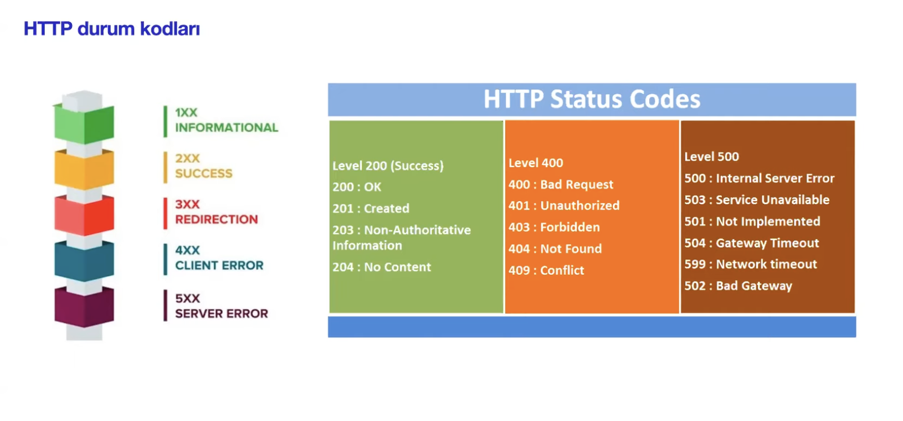

# Mersys Campus API Tests


---

## Table of Contents
1. [Project Overview](#project-overview)
2. [Features](#features)
3. [Installation](#installation)
4. [Configuration](#configuration)
5. [Usage](#usage)
6. [Folder Structure](#folder-structure)
7. [Dependencies](#dependencies)
8. [Reporting and Logs](#reporting-and-logs)
9. [HTTP Status Codes](#http-status-codes)
10. [Contributors](#contributors)
11. [License](#license)
12. [Contact](#contact)

---

## Project Overview
The **campus-api-tests** repository is a comprehensive API testing framework for Mersys Campus endpoints.  
This project leverages **Rest Assured, TestNG, Hamcrest, and JavaFaker** to automate API tests, ensuring stability and accuracy of backend services.

---

## Features
- **API Automation** – Supports CRUD operations via `GET`, `POST`, `PUT`, and `DELETE` requests.
- **Data-Driven Testing** – Uses JavaFaker for dynamic data generation.
- **Modular Design** – Reusable request/response specifications for enhanced test scalability.
- **Comprehensive Logging** – Logs API requests/responses for better debugging and reporting.
- **Parallel Test Execution** – Executes tests concurrently to reduce runtime.
- **Reporting** – Detailed HTML reports via TestNG.

---

## Installation
### 1. Clone the Repository
```bash
git clone https://github.com/cihat-kose/campus-api-tests.git
```

### 2. Import the Project (IntelliJ IDEA)
1. **File > New > Project from Version Control**
2. Enter Repository URL:
   ```bash
   https://github.com/cihat-kose/campus-api-tests.git
   ```
3. **Maven auto-import** should download dependencies automatically.

---

## Configuration
### IntelliJ Plugins (Recommended)
- **TestNG**
- **Maven Helper**
- **REST Client**
- **Lombok Plugin** *(Optional)*

---

## Usage
### Running Tests
#### 1. Run All Tests
```bash
mvn clean test
```

#### 2. Run Specific Tests (via IntelliJ IDEA)
- Right-click `testng.xml`
- Select **Run 'testng.xml'**

---

## Folder Structure
```plaintext
campus-api-tests/
├── src/
│   └── test/
│       ├── java/
│       │   └── campus/
│       │       ├── auth/                        # Authentication tests
│       │       │   ├── LoginNegativeTests.java
│       │       │   ├── LoginPositiveTests.java
│       │       │   └── LoginWithRawJsonTest.java
│       │       ├── base/
│       │       │   └── BaseTest.java            # Base class for tests
│       │       ├── school/                      # School-related API tests
│       │       │   ├── AttestationsTests.java
│       │       │   ├── BankAccountsTests.java
│       │       │   ├── DepartmentsTests.java
│       │       │   ├── DiscountsTests.java
│       │       │   ├── DocumentTypesTests.java
│       │       │   ├── FieldsTests.java
│       │       │   ├── GradeLevelsTests.java
│       │       │   ├── NationalitiesTests.java
│       │       │   ├── PositionCategoriesTests.java
│       │       │   ├── PositionsTests.java
│       │       │   ├── SchoolLocationsTests.java
│       │       │   └── SubjectCategoriesTests.java
│       │       ├── student/                     # Student-related API tests
│       │       │   └── StudentGroupsTests.java
│       │       └── utils/
│       │           └── UserCredentials.java     # Utility class for credentials
│       └── resources/
│           └── testng.xml                       # TestNG suite configuration
├── target/                                      # Build outputs and reports
├── images/                                      # Project images
├── LICENSE                                      # Project license (MIT)
├── pom.xml                                      # Maven dependencies
└── README.md                                    # Documentation
```

---

## Dependencies
Managed via `pom.xml`:
- **RestAssured** – API requests
- **TestNG** – Test execution
- **Hamcrest** – Enhanced assertions
- **Jackson** – JSON handling
- **JavaFaker** – Data generation
- **SLF4J** – Logging

---

## Reporting and Logs
- **HTML Reports** – Generated in `target/surefire-reports`
- **Logs** – Detailed request/response logs
```bash
cat target/surefire-reports/emailable-report.html
```

---

## HTTP Status Codes
This project commonly encounters a variety of HTTP status codes in responses.  
Below is a summary of some frequently used status codes and their meanings:



---

## Contributors
- [cihat-kose](https://github.com/cihat-kose) – **Team Lead / Software Tester**
- [AyseGun18](https://github.com/AyseGun18) – **Software Tester**
- [CihanDilber](https://github.com/CihanDilber) – **Software Tester**
- [HavvaGonul](https://github.com/HavvaGonul) – **Software Tester**
- [seretto](https://github.com/seretto) – **Software Tester**
- [seymanuripek](https://github.com/seymanuripek) – **Software Tester**
- [TlpAyn](https://github.com/TlpAyn) – **Software Tester**
- [yilmazas](https://github.com/yilmazas) – **Software Tester**
- [Zafer-Yilmaz](https://github.com/Zafer-Yilmaz) – **Software Tester**

To contribute:

1. Fork the repository.
2. Create a new branch (`git checkout -b feature-branch`).
3. Commit your changes (`git commit -m 'Add new feature'`).
4. Push to the branch (`git push origin feature-branch`).
5. Create a Pull Request.

---

## License
MIT License – See [LICENSE](LICENSE) file.

---

## Contact
For any questions or contributions, open an issue on GitHub.